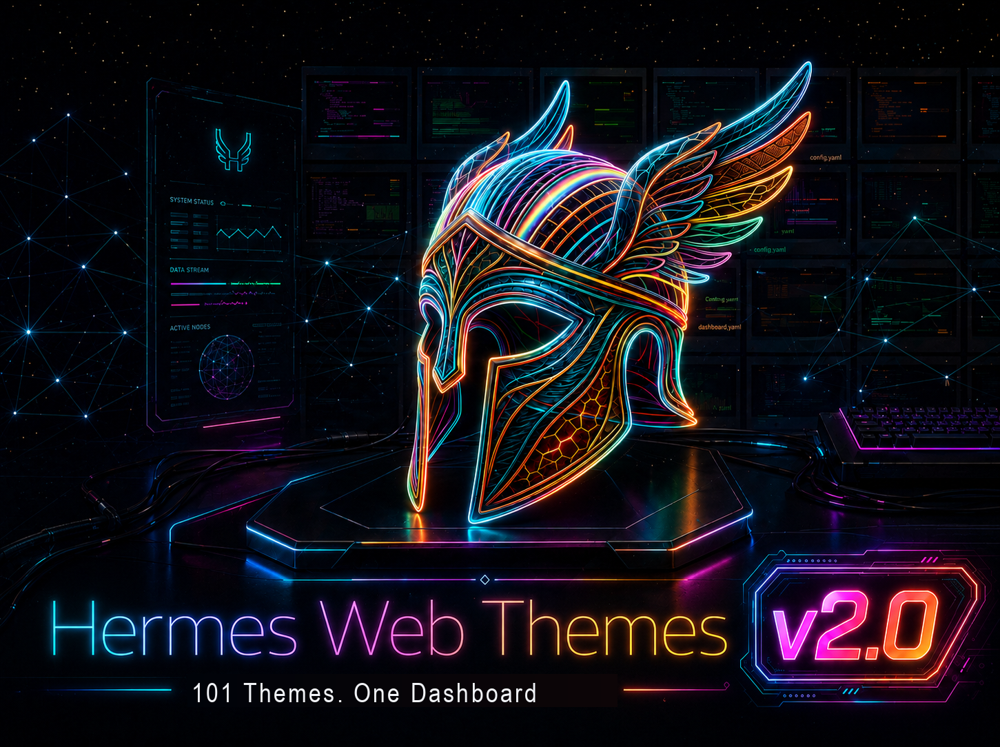

# hermes-web-themes

**101 drop-in themes** for the [Hermes Agent](https://github.com/NousResearch/hermes-agent)
web dashboard, ported from
[hermes-skins-pack](https://github.com/bchop-studio/hermes-skins-pack).

[](https://github.com/bchop-studio/hermes-web-themes/actions/workflows/validate.yml)
[](LICENSE)

## Preview



## Install

Copy or symlink the themes into your Hermes dashboard-themes directory:

```bash
mkdir -p ~/.hermes/dashboard-themes
cp themes/*.yaml ~/.hermes/dashboard-themes/
# or, to stay in sync with this repo:
ln -s "$PWD"/themes/*.yaml ~/.hermes/dashboard-themes/
```

Then pick a theme in the dashboard, or set it in config:

```bash
hermes config set dashboard.theme dracula
```

## Regenerate from the skins

Requires Python 3 with `pyyaml`.

```bash
python3 scripts/convert.py            # reads ~/github/hermes-skins-pack/skins
python3 scripts/validate.py           # validates all themes in themes/
python3 -m unittest discover -s tests -v
```

`convert.py` accepts `--skins-dir` and `--out-dir` overrides.

Browse the complete [theme index](themes/README.md). See
[CONTRIBUTING.md](CONTRIBUTING.md) before adding or changing a theme.

## Theme format

One YAML per theme. Fields: `name`, `label`, `description`;
`palette` with `background` / `midground` / `foreground` layers
(each `{hex, alpha}`), `warmGlow` (rgba string) and `noiseOpacity`;
optional `typography` and `layout`; `colorOverrides` for shadcn token
accents (`primary`, `accent`, `border`, `success`, `warning`,
`destructive`, ...). The full schema is defined by
`_normalise_theme_definition` in `hermes_cli/web_server.py`. Missing optional
settings inherit from Hermes' built-in default dashboard theme.

---

MIT. Do whatever you want with these.

Made by @BChopLXXXII

Built for vibe coders who just want their AI to feel less... corporate.

Ship it. 🚀

If this helped, ⭐ the repo — it helps others find it.
